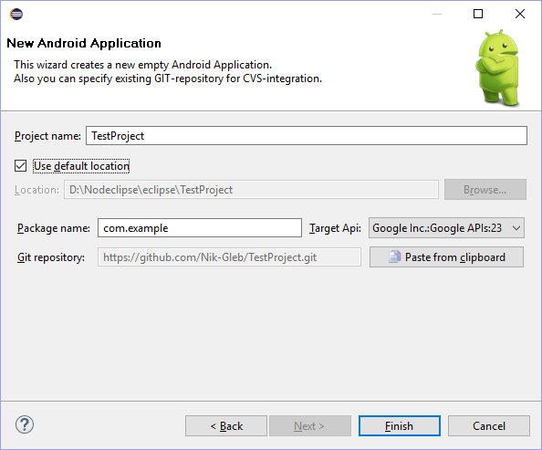

# New Android Application Wizard.

> *It allows you to create a new Android Projects quick and easy. Is a lite alternative to standard ADT-Wizard. Creates a minimum-allowable empty application, ready for assembly and publication. Automates the initial GIT-integration.*

 

## Repository.

Contains three Eclipse-project:

*   Plugin - A plugin that implements logic of wizard
*   Feature - 'Eclipse-feature' for groups plugins (yet single) by features
*	Update Site - The site for the plug-in installation
